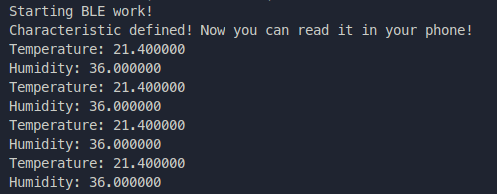
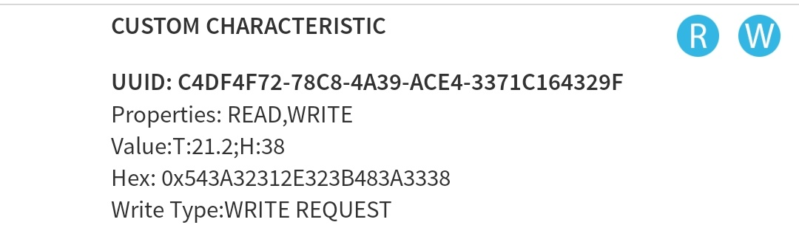

# 🌡️ Connected Thermometer

This project is what we call a "Hub Experience" in EPITECH. The purpose is to discover something new, explore new technologies and try to learn things that are not in our studies.

With this project I'm discovering the world of the IoT and the Bluetooth communication protocols.

## 📃 Prerequisite

1. ESP32
2. Wires
3. Bread board
4. DHT32 themperature module
5. Bluetooth stream reader on your phone (Like BLE scanner)

## ℹ️ Informations

- Language: C++
- Software: VSCode
- Platform: PlatformIO
- Hardware: ESP32
- Technology: Bluetooth

## 🤓 Usage

The ESP32 has an integrated BLE module, I'm using it to communicate with a phone and send the temperature under the format `T:<temperature>;H:<humidity>`.

Connect the ESP32 device named `TempSensor`, then read the data, you should get an output like this:

## 🏷️ Author

- [Theo Mazars](https://github.com/theo-mazars)

## 🔓 License

This project is too simple to use a License. Feel free to reuse the code.